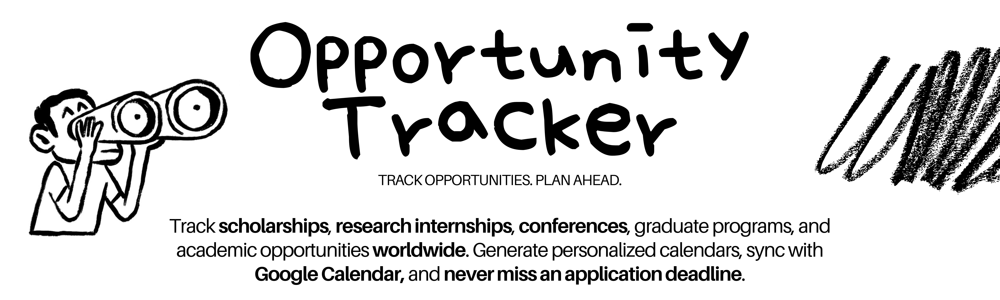

<p align="center">
  
</p>

<p align="center">
  <a href="https://lumiis2.github.io/opportunity-tracker/">Access calendars</a>
  ·
  <a href="https://github.com/lumiis2/opportunity-tracker/issues">Suggest or correct</a>
  ·
  <a href="tutorials-and-info/%22How%20to%20Contribuite%3F%22.md">Contribution guide</a>
  ·
  <a href="README-pt.md">Português</a>
</p>

---

## What is the Opportunity Tracker?

Incredible academic and professional opportunities exist by the thousands, but they are scattered across the internet — and many people only find them after the deadline has passed.

The **Opportunity Tracker** gathers opportunities for undergraduate, master's, conferences, and industry in easy-to-follow calendars. The proposal is straightforward: choose a category, add the link to your calendar application, and have the deadlines available where you already organize your routine.

This is an open and collaborative project. You can use the ready-made calendars, customize them, or help make them more complete and useful for others.

## Start here

👉 **[Access the Opportunity Tracker page](https://lumiis2.github.io/opportunity-tracker/)**

It gathers all available calendars, their subscription links, and the respective data in CSV format.

## Available calendars

Copy the calendar URL and paste it into the **From URL** option in your calendar app.

| Category | Calendar URL — copy and paste | Download `.ics` | Download CSV |
| --- | --- | --- | --- |
| 🎓 Undergraduate | `https://lumiis2.github.io/opportunity-tracker/graduation.ics` | [graduation.ics](https://lumiis2.github.io/opportunity-tracker/graduation.ics) | [graduation.csv](https://lumiis2.github.io/opportunity-tracker/data/graduation.csv) |
| 🏫 Master's | `https://lumiis2.github.io/opportunity-tracker/masters.ics` | [masters.ics](https://lumiis2.github.io/opportunity-tracker/masters.ics) | [masters.csv](https://lumiis2.github.io/opportunity-tracker/data/masters.csv) |
| 💼 Industry | `https://lumiis2.github.io/opportunity-tracker/industry.ics` | [industry.ics](https://lumiis2.github.io/opportunity-tracker/industry.ics) | [industry.csv](https://lumiis2.github.io/opportunity-tracker/data/industry.csv) |
| 📚 Conferences | `https://lumiis2.github.io/opportunity-tracker/conferences.ics` | [conferences.ics](https://lumiis2.github.io/opportunity-tracker/conferences.ics) | [conferences.csv](https://lumiis2.github.io/opportunity-tracker/data/conferences.csv) |

## How to use

### 1. Subscribe via link — recommended

Copy the address of the `.ics` file of the desired category and add it via the **By URL** option in your calendar application.

When subscribing, the application checks the same address periodically. This way, updates published to the calendar can appear for those already using the link, without the need to manually download a new file.

### 2. Download the `.ics` file

Open one of the `.ics` links in the table and save the file to import it into Google Calendar, Apple Calendar, Outlook, or another compatible application.

> **Attention:** importing a downloaded file creates a one-time copy. To receive future updates, prefer subscribing via URL.

### 3. Download the data in CSV

Use the **Download CSV** column to query, filter, or edit the data of a category. These files also serve as a template for creating a personalized calendar.

### 4. Generate a personalized calendar locally

Clone the repository and install the dependencies:

```bash
git clone https://github.com/lumiis2/opportunity-tracker.git
cd opportunity-tracker
python -m venv .venv
source .venv/bin/activate
pip install -r requirements.txt
```

Copy or download an official CSV, remove or edit the lines you wish, and run:

```bash
python -m src.cli generate-ics \
  --track graduation \
  --input opportunities.csv \
  --output my_calendar.ics
```


Accepted values for `--track`: `graduation`, `masters`, `industry`, and `conferences`.

This workflow works locally and does not depend on Google Sheets, credentials, GitHub Pages, or an internet connection.
The CSV must maintain the same columns as the official file of the chosen category.
To use a different column format, you will need to implement a new parser.

## Add to Google Calendar via URL

Perform the first subscription through Google Calendar in a computer browser:

1. Copy the `.ics` link of the desired category.
2. Open [Google Calendar](https://calendar.google.com/).
3. Next to **Other calendars**, click the **+** button.
4. Choose **From URL**.
5. Paste the link and click **Add calendar**.
6. The new calendar will appear under **Other calendars**.

Google Calendar controls the update frequency of external calendars. A newly added calendar or a recent change may take a few minutes — and, in some cases, a few hours — to appear.

## How to contribute

This project does not intend to be a single person's calendar. The more people who share knowledge, the more students will be able to discover and prepare for good opportunities.

You can contribute by:

- adding new opportunities;
- correcting dates or outdated information;
- improving descriptions and links;
- suggesting new categories;
- writing guides and tutorials;
- fixing bugs or improving the code;
- creating a fork for calendars of a specific area or community.

For a direct change, fork the project, create a branch, and open a [Pull Request](https://github.com/lumiis2/opportunity-tracker/pulls). For a suggestion, question, or specific correction, open an [Issue](https://github.com/lumiis2/opportunity-tracker/issues).

When editing a CSV, preserve its headers and the column format so that the calendar continues to be generated correctly.

## Future vision

The calendars are just the first step. The long-term vision is to build a collaborative knowledge base about academic and professional opportunities.

In the future, each opportunity could have content explaining the program, who can participate, how the selection works, common documents, timelines, participant experiences, preparation tips, and useful links. The idea also includes space for recurring programs or those without a defined date yet.

<p align="center">
  <strong>Found an opportunity? Share it. See something wrong? Correct it.<br>
  This project gets better whenever someone decides to help.</strong>
</p>

## License

Distributed under the [MIT license](LICENSE).
